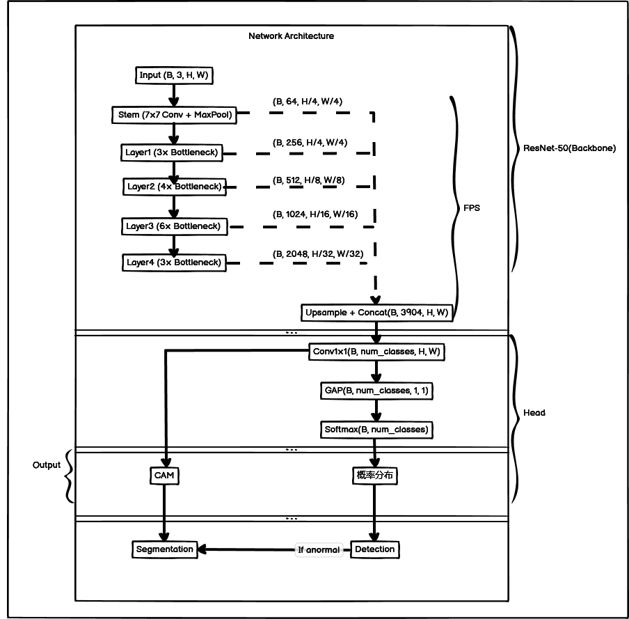

# M-ClassAnomalyDetector

基于多尺度特征融合的工业线缆缺陷异常检测系统。

**输入**：只有图像级标签（正常/异常，或具体缺陷类别）
**网络**：CNN 提取多尺度特征 → 统一尺寸 → 通道拼接 → GAP → 分类
**输出**：分类结果 + 多层融合的精细热力图（可转化为分割掩码）
**效果**：不依赖任何像素级标注，却能产出接近全监督的定位精度

## 数据集

使用 [MVTec Anomaly Detection (MVTec AD)](https://www.mvtec.com/company/research/datasets/mvtec-ad) 数据集，包含 15 个工业品类（如瓶盖、电缆、胶囊、螺栓等），每个品类包含正常样本和多种缺陷类型。

## 项目结构

```
M-ClassAnomalyDetector/
├── addBlock.py          # 网络基础模块（残差块、深度可分离卷积）
├── model.py             # ResNet-50 模型定义（多尺度特征融合）
├── augment.py           # 图像增强模块（7种增强方法，参数可调）
├── train.py             # 训练脚本（CSV日志、CAM热力图、每类准确率）
├── visualize.py         # 可视化脚本（损失/准确率曲线、混淆矩阵、CAM）
├── balance_normal.py    # 类别平衡脚本（解决 normal 样本过多问题）
├── data/                # 数据集目录（.gitignore）
│   ├── raw/             # 原始图像
│   └── augmented/       # 增强后图像
│       ├── normal/
│       └── anormaly/
│           ├── bent_wire/
│           ├── cable_swap/
│           ├── combined/
│           ├── cut_inner_insulation/
│           ├── cut_outer_insulation/
│           ├── missing_cable/
│           ├── missing_wire/
│           └── poke_insulation/
├── logs/                # 训练日志和CSV（.gitignore）
├── cam_outputs/         # CAM 热力图输出（.gitignore）
└── best_model.pth       # 最佳模型权重（.gitignore）
```

## 模型架构

### ResNet-50 多尺度特征融合


```
Input (B, 3, H, W)
  │
  ├── Stem (7×7 Conv + MaxPool)     → (B, 64, H/4, W/4)
  ├── Layer1 (3× Bottleneck)        → (B, 256, H/4, W/4)
  ├── Layer2 (4× Bottleneck)        → (B, 512, H/8, W/8)
  ├── Layer3 (6× Bottleneck)        → (B, 1024, H/16, W/16)
  ├── Layer4 (3× Bottleneck)        → (B, 2048, H/32, W/32)
  │
  ├── Upsample + Concat             → (B, 3904, H, W)
  ├── Conv1×1                        → (B, num_classes, H, W)  ← CAM
  ├── GAP                            → (B, num_classes, 1, 1)
  └── Output                         → (B, num_classes)
```

### 支持的残差块

| 模块 | 结构 | 特点 |
|------|------|------|
| `ResidualBottleneckBlock` | BN→ReLU→Conv1×1 → BN→ReLU→Conv3×3 → BN→ReLU→Conv1×1 | 标准 ResNet-v2 前激活 |
| `DWBottleneckBlock` | BN→ReLU→Conv1×1 → BN→ReLU→DW3×3+PW1×1 → BN→ReLU→Conv1×1 | 深度可分离，参数量减少约40% |

### 模型参数调节

| 参数 | 说明 | 示例 |
|------|------|------|
| `use_dw` | 是否使用深度可分离卷积 | `True` / `False` |
| `width_factor` (α) | 宽度因子，缩放中间通道数 | 0.5=轻量, 1.0=标准 |
| `resolution_factor` (ρ) | 分辨率因子，缩放输入图像尺寸 | 0.5=加速, 1.0=标准 |

```python
from model import ResNet50

# 标准 ResNet-50
model = ResNet50(num_classes=9)

# 轻量版（深度可分离 + 半宽度）
model = ResNet50(num_classes=9, use_dw=True, width_factor=0.5)
```

## 使用方法

### 1. 图像增强

```python
from augment import ImageAugmentor, collect_images, batch_augment

# 收集图像
image_dict = collect_images('./data/raw')

# 批量增强（指定方法组合和参数）
batch_augment(
    image_dict, output_dir='./data/augmented',
    num_augments=100,
    methods=['rotate', 'brightness', 'translate'],
    params={
        'rotate': {'angle_range': (-30, 30)},
        'brightness': {'factor_range': (0.7, 1.3)},
    }
)
```

增强方法：`rotate`, `crop`, `mosaic_blur`, `mosaic_shuffle`, `translate`, `brightness`, `scale`

### 2. 类别平衡

```bash
python balance_normal.py
```

按原图分组等比例随机删除 normal 样本，使各类别数量级一致。

### 3. 训练

```bash
python train.py
```

主要参数（在 `__main__` 中修改）：

| 参数 | 默认值 | 说明 |
|------|--------|------|
| `data_dir` | `./data/augmented` | 数据目录 |
| `num_epochs` | 100 | 训练轮数 |
| `batch_size` | 8 | 批大小 |
| `lr` | 1e-3 | 学习率 |
| `img_size` | 224 | 输入尺寸 |
| `use_dw` | True | 深度可分离 |
| `width_factor` | 0.5 | 宽度因子 |
| `resolution_factor` | 1.0 | 分辨率因子 |

训练产出：
- `best_model.pth` — 最佳模型权重（含类别映射和模型配置）
- `logs/train_*.csv` — 训练日志（损失、准确率、每类准确率、学习率）
- `cam_outputs/epoch_*/` — 每轮 CAM 热力图

### 4. 可视化

```bash
python visualize.py
```

生成图表（保存至 `visualizations/`）：
- 损失曲线、准确率曲线
- 各类别准确率曲线
- 学习率曲线
- 混淆矩阵热力图
- CAM 类激活图

## CAM 类激活图

模型的 1×1 卷积输出每个通道对应一个类别的激活图，可用于可视化模型"关注"的区域：

```
原图 | 热力图 | 叠加图
```

用于异常检测时，热力图高亮区域即为模型判断的异常位置。

## 注意事项

**模型输出为 raw logits，不要在模型末尾加 Softmax**

`CrossEntropyLoss` 内部已包含 `log_softmax`，如果模型输出再加 `nn.Softmax`，会导致双重 softmax，梯度被压缩到极小值，模型无法学习（表现为 loss 不降、所有样本预测为同一类别）。

```python
# 错误：模型输出 softmax 概率 → CrossEntropyLoss 再做 log_softmax → 双重压缩
x = self.softmax(x)
return x

# 正确：直接输出 raw logits，由 CrossEntropyLoss 处理
return x
```

推理时如需概率分布，可手动加 softmax：
```python
probs = torch.softmax(logits, dim=1)
```

## 参考论文

1. He et al., "Deep Residual Learning for Image Recognition", CVPR 2016
2. He et al., "Identity Mappings in Deep Residual Networks", ECCV 2016
3. Howard et al., "MobileNets: Efficient CNN for Mobile Vision Applications", 2017
4. ZHOU B, KHOSLA A, LAPEDRIZA A, 等. Learning Deep Features for Discriminative Localization[EB/OL]. arXiv, 2015[2026-01-14]. http://arxiv.org/abs/1512.04150.
